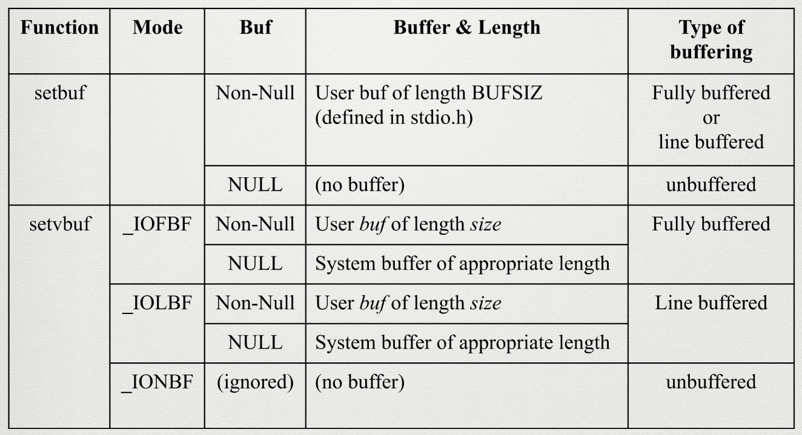

# 03 - High-level File Access (function call)

## Libraries used
* `#include <stdio.h>`

## File pointers
This is used as a file stream specifiers. 
- `stdin`
- `stdout`
- `stdout`


## Syntax
### `fopen()`
* `FILE * fopen(const char* pathName, const char* type);`

type : used for indicating the operation of the opened file
* `r` : read
* `w` : write

```c
FILE *in;
in = fopen("file.in", "r");
```
| Type | Decription |
| ---- | ---------- |
| `r or rb` | for reading|
| `w or wb` | Truncate to 0 length or creat fir writing |
| `a or ab` | Append; if data exist wirte at the end of file else, writing normally |
| `r+ or r+b or rb+` | for reading and writing |
| `w+ or w+b or wb+` | Truncate to length 0 or create for reading and writing | 
| `a+ or a+b or ab+` | Open or create for reading and writing at the end of file |

### `fread()`
* `size_t fread(void * buffer, size_t sizeOfEachElem, size_t numsOfElem, FILE* stream);`

    - return
        - `numbers of items read` : success
        - `short item count or 0` : if fail or reach EOF

### `fwrite()`
* `size_t fwrite(void * buffer, size_t sizeOfEachElem, size_t numsOfElem, FILE* stream);`

    - return
        - `numbers of items written from stream` : success
        - `short item count or 0` : if fail or reach EOF

### `fclose()`
* `int fclose(FILE * fp);`

    - return
        - `0` : success
        - `EOF` : error

### `fseek()`
 * `int fseek(FILE * stream, long offest, int whence);`
    - whence specifiers
        - **SEEK_SET** : beggining of the file
        - **SEEK_CUR** : current position
        - **SEEK_END** : end of file
    
    - return
        - "rewind function returns no value."
        - `0` : success
        - `-1` : fail + global errno is set

### `fflush()`
* `int fflush(FILE * stream);`

    - return
        - `0` : success
        - `EOF` : error + arrno is set

### `get` -> scan

- `fgetc()` : read nest char from the stream or EOF or error
    * `int fgetc(FILE *stream);`
- `getc()` : same as fgetc() but is implemented oas a macro that eveluates stream more than once.
    * `int getc(FILE *stream);`
- `getchar()` : getc(stdin);
    * `int getchar(void);`

- `ungetc()` : pushed char back to stream
     * `int ungetc(int ch, FILE *stream);`
- `fgets()` : read with size of stream - 1 or until EOF/endline.
    * `int *gets(char *ch, int size, FILE *stream);`
- `gets()` : read a line from stdin in to the buffer pointed by ch.
    * `int gets(char *ch);`

### `put` -> print
- `fputc()` : cast char to unsigned char and write to the stream
    * `int fputc(int ch, FILE *stream);`
- `putc()` : macro of <u>fputc()</u> to evaluate stream more than once
    * `int putc(int ch, FILE *stream);`
- `putchar(ch)` : putc(ch, stdout);
    * `int putchar(int ch);`
- `fputs()` : write string into the stream without trailling '\0'
    * `int fputs(const char *ch, FILE *stream);`
- `puts()` : write string and trailing to stdout.
    * `int puts(const char *ch);`

### `setbuf()`
There are 3 buffering types

`Fully buffered` : read from the stream until the buffer is full

`Line buffered` : read from the stream until there is a newline character

`unbuffered` : which ever is written into the stream, it is written to the file immediately

- `void setbuf(FILE* filePointer, char* buffer);`
- `int setvbuf(FILE* filePointer, char* buffer, int mode, size_t size);`
    - return
        - `0` : success
        - `non-zero` : error

