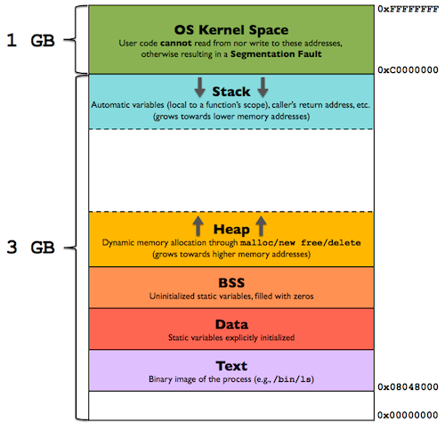

# 04 - Multiple Processes

## Program Address Space



From bottom to top :
- `Text Segment` : stores all the codes, including main code and function code.
- `.Data Segment` : intitialized global static data (e.g. `char name[] = "bob";`)
- `.BSS Segment` : uninitialized global static data (e.g. `char name[100];`)
- `Heap Segment` : static variable managed by `malloc()`, `realloc()`, `free()`
- `Stack Segment` : automatic / local variables, parameters and return values.

## Definition of Multiprocesses
- Multiprocess is the program that generate another program and runs it in parallel. The main process of the program is called **`Parent Process`** and the process that is newly created by Parent process is called **`Child Process`**.

- When child processis cretated, it copies the parent's address space of the parent to be its environment.

## Essentail linux command
- `ps -al` : show all running processes

## Libraries used
- `#include <unistd.h>`

## Syntax
### `fork()`
* `int fork();`
    - return
        - `0` : this is the newly created child process
        - `> 1` : this is the parent process.
        - `-1` : fork failed

```c
int pid = fork();
```

**Method to get the ID of process**
- `getpid()` : return the its process ID
- `getppid()` : return the process ID of its parent

### `wait`
wait is used to communicate between parent and child processes. By calling wait, parent will wait until child finish execution and send the exit signal to parent. This also allows parent to obtain child exit status information.

* **`wait()`**
    - using `wait(&status)` will return the process ID and information of the terminated child process
        - `WIFEXITED(status)` : true if exit normally
        - `WIFSIGNALED(status)` : true if process is killed by signal
    - using `wait(NULL)` will only wait for child process to terminated
    - return
        - `-1` : failed
        - `pid of terminated child` : success
```c
if(pid){ // parent process
    int status;
    int endedChildPID = wait(&status);
}
```
```c
if(pid){ // parent process
    wait(NULL);
}
```
* **`waitpid()`**
    - This is used to wait for a specific child process to end
    - `int endedChildPID = waitpid(pid_t 
    pid, int *status, int options);`
    - value of pid can fall into 4 cases:
        - **case : < -1** : wait for any child whose process group ID == abs(pid)
        - **case : -1** : wait for any child process
        - **case : 0** : waits for child in the same process group as the current process 
        - **case : > 1** : wait for predetermined process ID
    - options is basiclly macro set by bitwise OR of 0 and macro bits. Macro example :
        - **WNOHANG** : check child process without suspending current process
    - return
        - `-1` : failed
        - `pid of terminated child` : success
```c
if(pid){ // parent process
    int status;
    int endedChildPID = waitpid(pid, &status, 0); // can be any macro but 0 is default
}
```
### `exec()`
exec function is used to replace the current process with the entire new process. Exec can be used to call any **excutable functions**. That means it also cover **linux commands**.
* **`execl()`** -> l from 'list'
    - `execl(const char *filePath, const char *arg0, ... , NULL);`
```c
// assume that we have print.c built and compiled
execl("./print", "print", "Hello", "World!", NULL);
```
* **`execv()`** -> v from 'vector'
    - `execl(const char *filePath, const char argv[]);`
```c
// assume that we have print.c built and compiled
char *argv[] = {"print", "Hello", "World!", NULL};
execl("./print", argv);
```

### `vfork() and copy on write`
if you want to fork a child process to execute another program like calling **exec**, calling **vfork()** is more efficient as fork() is so much costly for system resources and vfork() does not copy entire address space.

## Zombie and Orphan
### `Zombie`
Zombie process is the process that child finished its execution but parent does not receive the exit status of child. In other words, **`child finishes before parent calls wait()`**, so the child will still be around in the system. Therefore, when call `ps -al` that zombie process will be flagged `z` and `<defunct>` by the system.
### `Orphan`
Orphan process is the process that parent finished execution and exit before child process. However, nowadays, Linux has approaches to adopted the orphan process if it occurs.
